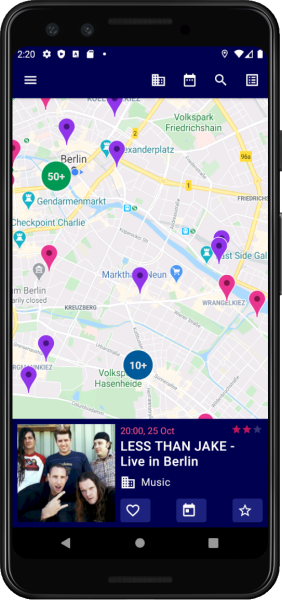

# Whappens

## Description
Android application to find events around you. Uses ```Google Maps, Firebase, Retrofit, Glide, AndroidX```.



## Requirements
Android API level 21+
Maps SDK via Google Play Services

## API Keys
Google Maps requires an API key. API keys are generated in the [Credentials](https://console.cloud.google.com/apis/credentials) page of the 'APIs & Services' tab of Google Cloud console.
For even more information on getting started with Google Maps Platform and generating/restricting an API key, see [Get Started](https://developers.google.com/maps/documentation/android-sdk/get-api-key) with Google Maps Platform.

## Firebase
Firebase requires ```google-services.json``` config file added to the project. See [Add Firebase to your Android project](https://firebase.google.com/docs/android/setup) for more additional information.